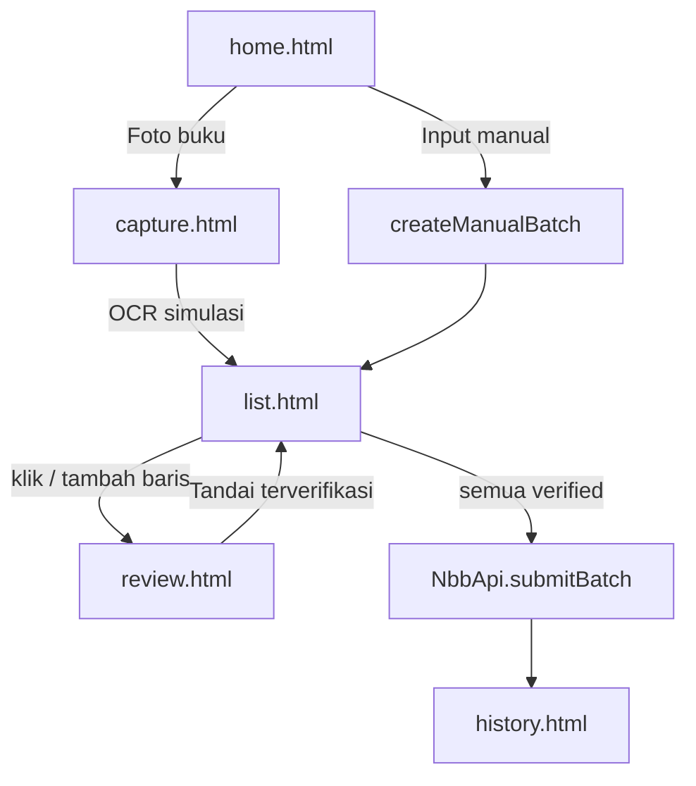

# 03 — Alur data (captura → submit)

## Dua jalur captura

### Jalur foto

1. Ambil / pilih gambar.
2. `NbbStore.simulateOcr` → batch `inputMode: 'photo'` + beberapa `items` (seed, **bukan** OCR mesin nyata).
3. Isi **konteks shared** di list (cabang, rayon, jenis submission, project, BR, sumber data).
4. Verifikasi tiap baris di review (termasuk **Produk Prospek**).
5. Kirim batch jika semua `verified`.

### Jalur manual

1. Home → **Input manual**.
2. Batch tanpa `photoDataUrl`, header list kosong.
3. **Tambah baris** tanpa batas → isi detail → verifikasi.
4. Kirim batch sama seperti jalur foto.

## Unit data

**Batch** (1 foto atau 1 sesi manual) berisi:

- Konteks shared + `status` (`draft` | `submitted` | `failed`)
- `items[]` dengan flag `verified`

Disimpan di:

| Key | Isi |
|-----|-----|
| `nbb_draft_capture_v1` | Batch sedang dikerjakan |
| `nbb_batches_v1` | Riwayat batch |
| `nbb_masters_v2` | Cache master (stub / nanti API) |
| `nbb_session_v1` | Session login demo |
| `nbb_config_v1` | Config mock / API submit |

## Validasi singkat

- **Batch:** cabang, jenis submission, BR, sumber data wajib.
- **Item:** produk prospek, status, nama depan PIC, JK PIC, HP (10–15 digit), dll.
- **Submit:** semua item `verified` + validasi batch & item lolos.

## Master data di alur ini

Dropdown di list & review **harus** diisi dari master (lihat [02-master-data.md](02-master-data.md)).  
ID yang tersimpan di batch/item akan dikirim di payload submit (`txtCabangID`, `txtBRID`, `txtSumberDataID`, `txtProdukProspekID`, …) — karenanya ID harus selaras dengan Master Data Kalbe & Octo.
